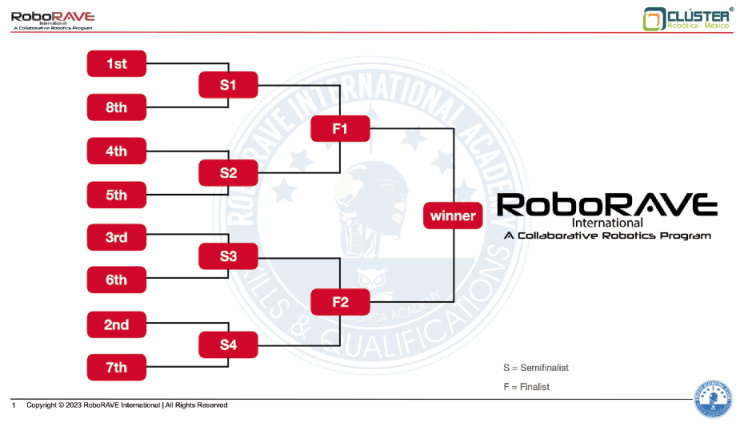

# Roborave-Trix

Design, build, and program a robot that can locate and extinguish without touching the 4 randomly placed candles inside a field outlined by a white & black line.

Teams entering this challenge compete in one combined division.

Note: If fewer than 5 teams registered in either division, the Event Director has the option to turn it into an exhibition challenge. 
Requirements 

Autonomous robot, any platform, costing $1,500 USD or less, and meets the following design constraints, which will be verified during Check-In or at the track: 

Check-In: 

1) Robot can demonstrate it is running a program that can control the start and stop of its extinguishing system via a sensor that interacts with either the candle or the circle the candle is placed on. 
2) If you use a high speed propeller you can only use a maximum diameter of 12cm, the robot must have a safety guard in place. 
3) Multiple sensors and processors are allowed. 
4) Volume of the robot must not exceed 65030 cm3 in it’s starting configuration. Click Here for the Video!
General Rules of Play and Scoring: 
1. The Event Director will establish the number of official races allowed and the number of those official races that will be counted towards the aggregate score used to determine the top 8 teams that will compete in the Tournament. 
2. The robot will start each heat at a point along the edge chosen by the challenge coordinator. 
3. The first candle will be in view of the robot at the start of the challenge. 
4. The remaining three sails will be protected by one, two or three barriers to make the challenge more interesting (the decision of which one has the barriers is up to the Event Director); so the members of the team must program their robot to detect the barriers and look for the side where there is no barrier to be able to extinguish the candle, without invading the circle where the candle is; The candle cannot be extinguished above the barrier (the points do not count if you do it this way), if you touch the barrier, points will be subtracted from your participation. 
5. The robot has 3 minutes to put out the 4 candles. 
6. If a player touches the robot after the challenge has started, time is stopped, the race ends, and the challenge will be scored based on the number of candles that were blown out when the robot was touched. 
7. Official tracks will be available for practice when not in use by competitors attempting an official race. 
Challenge Specifications: 
The Track: 
1. Challenge field is between 2.1m to 2.5 m wide, and 3.3m to 3.7m Long. 
2. A border will be constructed using white and black duct tape or printed. 
3. The border’s are constructed using two lines of white duct tape side by side. This will be about 7.5 cm wide. Then place a ½ a roll wide (approximately 2.5 cm) of black duct tape down the middle of the two white lines. 
4. The track may be fully printed on a white background. 
5. Candles and walls will be randomly placed for every run
The Candles 
● The candles stand at the center of a white vinyl circle, indicated by a 5 cm diameter black circle, with varying heights between 10cm and 45 cm. 
● The circle has a 40 cm diameter, and has a 2.5 cm black line that is 2.5cm in from the outer edge.

The Walls 

● The wall widths vary from 20 cm to 35cm and are 40 cm tall. They are held up by wooden bases that are 3.5 cm tall and may span the approximate width of the wall. 

All Challenge Dimensions are Approximate 

The challenge may be held in areas with natural light present which may change the lighting conditions of the track. Be prepared to engineer around this natural condition. 

Scoring 

The “remaining time bonus” is awarded, if and only if , all four candles are extinguished. Otherwise, the team receives only the points for candles extinguished. 

Penalty Rules: 

● 50% off the candle’s value, if: 

         ○ The robot blows out a candle when it is completely outside the circle but facing the candle and not the barrier or wall. 

           ○ The candle is touched during the process of extinguishing the flame. 

● The The process of extinguishing the lit candle is defined as: Detect the circle, extinguish and withdraw from the circle… during this time the robot cannot make contact with the candle. 

● Previously extinguished candles become obstacles in the playfield, and do not count as a penalty when touched. See the scoring matrix below for details on how points are assessed during your run. Scoring Matrix

See the scoring matrix below for details on how points are assessed during your run. 2 LAST EDIT: January 1, 2020 

The top eight teams will compete in the final tournament. 

● Advancing teams will be seeded into the tournament bracket according to their aggregate score (see bracket below).

● Runner Up is used to determine 3rd place based on outcome of semi-finals.
